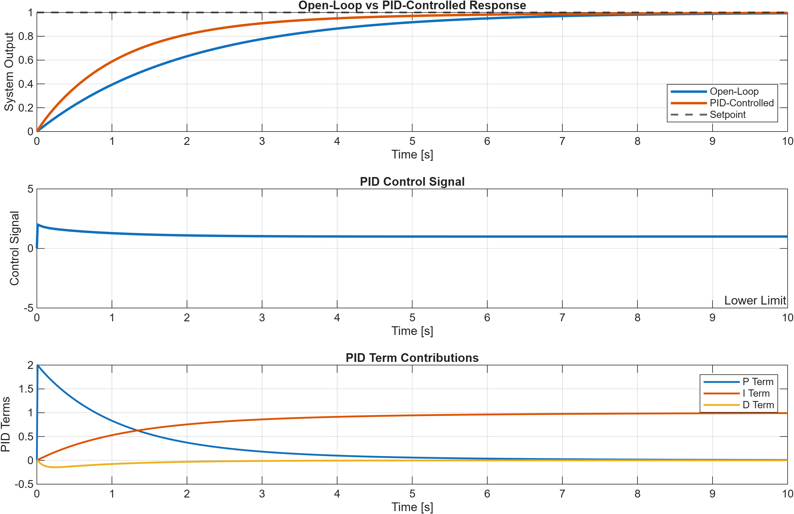

# MATLAB and Simulink Control Systems

## Overview

This project demonstrates basic control systems concepts using MATLAB and Simulink-style modeling.

It includes simulations of a first-order dynamic system and a PID-controlled system. The goal is to understand system response, controller behavior, and the effect of controller parameters on stability and performance.

This project is relevant for mechatronics, automation, control engineering, automotive systems, and electrical engineering.

## Main Features

- Simulates a first-order dynamic system
- Analyzes step response behavior
- Simulates a PID controller
- Shows the influence of proportional, integral, and derivative control
- Visualizes system response using MATLAB plots
- Provides documentation for a possible Simulink model structure
- Demonstrates basic control engineering workflow

## Technologies Used

- MATLAB
- Simulink concepts
- Control systems
- PID control
- Dynamic system simulation
- Data visualization

## Repository Structure

```text
matlab-simulink-control-systems/
│
├── first_order_system_simulation.m
├── pid_controller_simulation.m
├── README.md
├── requirements.md
├── simulink_model_description.md
└── screenshots/
    ├── first_order_response.png
    └── pid_controller_response.png
```

## Files Description

### `first_order_system_simulation.m`

This script simulates the step response of a first-order dynamic system.

A first-order system is commonly used to describe simple physical systems such as:

- thermal systems
- motor speed response
- fluid level systems
- simple electrical circuits
- mechanical systems with damping

The script defines the system parameters, calculates the response over time, and visualizes the result.

### `pid_controller_simulation.m`

This script simulates a PID-controlled system.

A PID controller uses three control parts:

- proportional control
- integral control
- derivative control

The goal is to improve system response by reducing error, improving settling behavior, and reaching the desired setpoint.

### `requirements.md`

This file explains the software requirements for running the project.

### `simulink_model_description.md`

This file describes how the same control system idea can be represented in a Simulink model using blocks such as:

- Step input
- Transfer function
- PID controller
- Scope
- Feedback loop

## Control Systems Background

### First-Order System

A first-order system can be represented by the transfer function:

```text
G(s) = K / (T s + 1)
```

Where:

- `K` is the system gain
- `T` is the time constant
- `s` is the Laplace variable

The time constant describes how quickly the system reacts to an input change.

### PID Controller

A PID controller can be represented as:

```text
u(t) = Kp e(t) + Ki ∫e(t)dt + Kd de(t)/dt
```

Where:

- `Kp` is the proportional gain
- `Ki` is the integral gain
- `Kd` is the derivative gain
- `e(t)` is the control error
- `u(t)` is the controller output

## Example Output

After running the MATLAB scripts, the project can generate plots such as:

### First-Order System Response


### PID Controller Response



## How to Run

1. Open MATLAB.
2. Open the project folder.
3. Run the first-order system script:

```matlab
first_order_system_simulation
```

4. Run the PID controller script:

```matlab
pid_controller_simulation
```

5. Check the generated plots.

## Skills Demonstrated

- MATLAB scripting
- Basic control systems understanding
- First-order system simulation
- PID controller simulation
- Step response analysis
- Plot generation and visualization
- Simulink model planning
- Engineering documentation

## What I Learned

- How to model simple dynamic systems
- How time constants affect system response
- How PID control improves system behavior
- How to visualize system response in MATLAB
- How MATLAB and Simulink concepts support mechatronics and control engineering tasks

## Possible Applications

- Mechatronics system control
- Motor control basics
- Temperature control systems
- Automation technology
- Automotive control systems
- Embedded control preparation
- Engineering simulation projects

## Future Improvements

- Add real Simulink `.slx` model files
- Compare different PID parameters
- Add overshoot, rise time, and settling time calculations
- Add disturbance response simulation
- Add motor speed control example
- Add export of plots directly from MATLAB scripts
- Add more control-system examples

## Project Status

This project was created as a MATLAB/Simulink engineering portfolio project focused on basic control systems, system response, and PID controller simulation.
